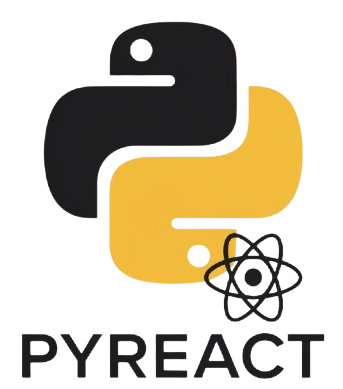

# PyReact

<div align="center">



**A Python-based React-like framework for building dynamic web applications**

[](LICENSE)
[](https://www.python.org/downloads/)
[](https://fastapi.tiangolo.com/)

</div>

---

## 📖 Overview

PyReact is a lightweight, React-inspired Python framework that brings component-based architecture to server-side web development. Built on top of FastAPI, PyReact enables developers to create dynamic, interactive web applications using familiar Python syntax while leveraging modern web development patterns.

### ✨ Key Features

- **🎯 Component-Based Architecture**: Build reusable UI components with Python decorators
- **⚡ FastAPI Integration**: Leverage FastAPI's speed and modern Python features
- **🔄 Real-time Updates**: WebSocket support for live page reloading during development
- **🛣️ Dynamic Routing**: Flexible routing system with parameter support
- **📦 State Management**: Built-in global state management
- **🎨 CSS Support**: Per-component and global CSS file management
- **🔌 Event Handling**: Simple event-driven programming model
- **📤 File Operations**: Built-in file upload and download support
- **🎭 View Transitions**: Support for modern browser view transition API
- **🔧 Hot Reload**: Automatic page refresh on code changes in development mode

---

## 🚀 Quick Start

### Prerequisites

- Python 3.7 or higher
- pip (Python package manager)

### Installation

1. Clone the repository:
```bash
git clone https://github.com/mianjunaid1223/PyReact.git
cd PyReact
```

2. Install dependencies:
```bash
pip install fastapi uvicorn beautifulsoup4 watchdog
```

### Running Your First App

1. The repository includes a sample app in `app.py`. Run it with:
```bash
python app.py
```

2. Open your browser and navigate to:
```
http://127.0.0.1:3000
```

You should see the PyReact welcome page with an animated text component!

---

## 📚 Usage Guide

### Creating Components

Components are the building blocks of PyReact applications. Use the `@component` decorator to create reusable UI elements:

```python
from pyreact import component

@component
def MyButton(props):
    text = props.get('text', 'Click me')
    return f"""
        <button class="my-button">
            {text}
        </button>
    """
```

### Defining Routes

Routes handle HTTP requests and return content. Use the `@route` decorator:

```python
from pyreact import route

@route("/")
async def home(request):
    return MyButton(text="Welcome to PyReact!")

@route("/about")
async def about(request):
    return "<h1>About Page</h1>"
```

### Dynamic Routes with Parameters

```python
@route("/user/<username>")
async def user_profile(request, username):
    return f"<h1>Profile: {username}</h1>"
```

### Application Setup

Initialize your PyReact app in your main file:

```python
from pyreact import pyreact

# Create the FastAPI app
app = pyreact.create_app()

# Configure static files directory
pyreact.set_static_dir("static")

# Add global CSS files
pyreact.add_global_css_file("styles.css")

# Set mode: "build" for development, "use" for production
pyreact.set_mode("build")

if __name__ == "__main__":
    import uvicorn
    uvicorn.run("app:app", host="127.0.0.1", port=3000, reload=True)
```

### Event Handling

PyReact supports event-driven interactions:

```python
from pyreact import event_handler

@event_handler("button_click")
def handle_button_click(component_id, *args):
    # Handle the event
    return {"status": "success", "message": "Button clicked!"}
```

In your HTML:
```html
<button data-event="click" data-click-handler="button_click">
    Click Me
</button>
```

### File Operations

**Sending Files:**
```python
@route("/download")
async def download_file(request):
    with open("document.pdf", "rb") as f:
        file_data = f.read()
    return await pyreact.send_file(file_data, "document.pdf")
```

**Receiving Files:**
```python
from fastapi import File, UploadFile

@route("/upload", methods=["POST"])
async def upload_file(request, file: UploadFile = File(...)):
    result = await pyreact.receive_file(file)
    return f"Uploaded: {result['filename']}"
```

### State Management

```python
# Access global state
pyreact.global_state['user'] = 'John Doe'

# State is automatically serialized and available in the frontend
# as window.INITIAL_STATE
```

### Redirects and JSON Responses

```python
# Redirect
@route("/redirect")
async def redirect_example(request):
    return pyreact.redirect("/", code=302)

# JSON Response
@route("/api/data")
async def api_data(request):
    return pyreact.jsonify({"message": "Hello", "status": "ok"})
```

---

## 🏗️ Project Structure

```
PyReact/
├── app.py                  # Main application file
├── pyreact.py              # Core framework code
├── index.html              # Base HTML template
├── components/             # Reusable components
│   ├── animated_text.py
│   └── image.py
├── static/                 # Static assets
│   ├── pyreact.js         # Frontend JavaScript
│   ├── styles.css         # Global styles
│   └── PyReact-logo.png   # Logo and images
└── LICENSE                 # Apache 2.0 License
```

---

## 🎨 Component Examples

### Image Component

```python
from pyreact import component

@component
def img(props):
    return f""""""
```

### Animated Text Component

```python
from pyreact import component

@component
def animated_text(props):
    return f"""
        <div class="container">
            <div>
                <h1 class="type">{props.get('text','Hello World!')}</h1>
            </div>
        </div>
    """
```

### Using Components

```python
@component
def App(props):
    return f"""
        {img(src='/logo', alt='Logo')}
        {animated_text(text='Welcome to PyReact')}
    """
```

---

## ⚙️ API Reference

### PyreactApp Methods

| Method | Description |
|--------|-------------|
| `create_app()` | Creates and returns a FastAPI application instance |
| `component(func)` | Decorator to register a component |
| `route(path, methods)` | Decorator to register a route handler |
| `set_static_dir(directory)` | Set the static files directory |
| `add_global_css_file(css_file)` | Add a global CSS file |
| `set_mode(mode)` | Set mode: "build" or "use" |
| `send_file(file_data, file_name, content_type)` | Send a file response |
| `receive_file(file)` | Receive an uploaded file |
| `redirect(location, code)` | Return a redirect response |
| `jsonify(*args, **kwargs)` | Return a JSON response |
| `abort(code, description)` | Abort with an HTTP error |
| `event_handler(event_name)` | Decorator to register an event handler |
| `before_request(func)` | Register a before-request handler |
| `after_request(func)` | Register an after-request handler |
| `errorhandler(code_or_exception)` | Register an error handler |

### Component Properties

Components receive a `props` dictionary with all passed properties:

```python
@component
def MyComponent(props):
    title = props.get('title', 'Default Title')
    content = props.get('content', '')
    return f"<div><h1>{title}</h1><p>{content}</p></div>"

# Usage
MyComponent(title="Hello", content="World")
```

---

## 🛠️ Development Mode

PyReact includes a development mode with hot reload capabilities:

```python
pyreact.set_mode("build")
```

Features in development mode:
- Automatic page reload on file changes
- WebSocket connection for live updates
- File watching for `.py`, `.js`, `.css`, and `.html` files
- Console logging for debugging

---

## 🌐 Frontend JavaScript API

PyReact includes a client-side JavaScript library (`pyreact.js`) that handles:

- Component initialization and lifecycle
- DOM observation and updates
- Client-side routing with history API
- WebSocket connections for live reload
- Event handling and delegation
- AJAX requests to the backend
- View transitions (when supported by browser)

Access the PyReact instance in your frontend code:
```javascript
window.pyreact.navigate('/new-page');
window.pyreact.triggerEvent('myEvent', data);
```

---

## 🤝 Contributing

Contributions are welcome! Here's how you can help:

1. **Fork the repository**
2. **Create a feature branch**: `git checkout -b feature/amazing-feature`
3. **Commit your changes**: `git commit -m 'Add amazing feature'`
4. **Push to the branch**: `git push origin feature/amazing-feature`
5. **Open a Pull Request**

### Development Guidelines

- Follow PEP 8 style guide for Python code
- Write clear commit messages
- Add tests for new features
- Update documentation as needed
- Ensure backward compatibility

---

## 📄 License

This project is licensed under the Apache License 2.0 - see the [LICENSE](LICENSE) file for details.

```
Copyright [yyyy] [name of copyright owner]

Licensed under the Apache License, Version 2.0 (the "License");
you may not use this file except in compliance with the License.
You may obtain a copy of the License at

    http://www.apache.org/licenses/LICENSE-2.0

Unless required by applicable law or agreed to in writing, software
distributed under the License is distributed on an "AS IS" BASIS,
WITHOUT WARRANTIES OR CONDITIONS OF ANY KIND, either express or implied.
See the License for the specific language governing permissions and
limitations under the License.
```

---

## 🔗 Links

- **Repository**: [https://github.com/mianjunaid1223/PyReact](https://github.com/mianjunaid1223/PyReact)
- **Issues**: [https://github.com/mianjunaid1223/PyReact/issues](https://github.com/mianjunaid1223/PyReact/issues)
- **FastAPI Documentation**: [https://fastapi.tiangolo.com/](https://fastapi.tiangolo.com/)

---

## 🙏 Acknowledgments

- Built with [FastAPI](https://fastapi.tiangolo.com/) - Modern, fast web framework for Python
- Inspired by [React](https://reactjs.org/) - JavaScript library for building user interfaces
- Uses [Beautiful Soup](https://www.crummy.com/software/BeautifulSoup/) for HTML parsing
- File watching powered by [Watchdog](https://github.com/gorakhargosh/watchdog)

---

## 📞 Support

If you have any questions or run into issues, please:
- Open an issue on GitHub
- Check existing issues for solutions
- Review the documentation

---

<div align="center">

**Made with ❤️ by the PyReact Team**

⭐ Star this repository if you find it helpful!

</div>
