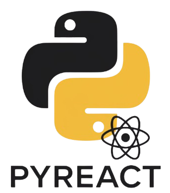

# PyReact

<div align="center">



A Python-based React-like framework for building dynamic web applications

[](LICENSE)
[](https://www.python.org/downloads/)
[](https://fastapi.tiangolo.com/)

</div>

---

## Overview

PyReact is a lightweight Python web framework that implements React-inspired component patterns for server-driven applications. Built on top of FastAPI and Starlette, PyReact allows developers to write declarative, reusable UI components in pure Python while maintaining fast server execution, real-time file-watching hot reloads, and dynamic client-side hydration.

## Core Capabilities

| Capability | Technical Scope |
|---|---|
| Component Architecture | Reusable functional UI elements created via the @component decorator |
| FastAPI Backend | ASGI foundation supporting async route definitions, request validation, and OpenAPI schemas |
| Real-Time Updates | Built-in WebSocket channel providing instant client reloads on code modifications |
| Dynamic Routing | URL pattern routing supporting dynamic path parameters like /user/<username> |
| State Hydration | Global state dictionary serialized to the DOM as window.INITIAL_STATE |
| Asset Pipeline | Per-component and global stylesheet aggregation with automatic link injection |
| Event Delegation | Declarative DOM event bindings via data-event and data-click-handler attributes |
| Binary File I/O | Async upload reception and streaming file downloads via io.BytesIO |
| View Transitions | Client-side route transitions using the browser View Transition API |
| Execution Modes | Development mode with Watchdog filesystem tracking or production ASGI serving |

---

## Quick Start

### System Prerequisites

- Python 3.7 or higher
- pip package manager

### Installation

Clone the repository and install dependencies:

```bash
git clone https://github.com/mianjunaid1223/PyReact.git
cd PyReact
pip install fastapi uvicorn beautifulsoup4 watchdog
```

### Running the Application

Launch the default development server using Python:

```bash
python app.py
```

Access the application in your browser:

```
http://127.0.0.1:3000
```

---

## Usage Guide

### Defining Components

Components represent functional building blocks in PyReact. Apply the @component decorator to functions that accept a props dictionary and return an HTML string:

```python
from pyreact import component

@component
def MyButton(props):
    text = props.get('text', 'Click me')
    return f"""
        <button class="my-button">
            {text}
        </button>
    """
```

### Defining Routes

Use the @route decorator to register asynchronous request handlers:

```python
from pyreact import route

@route("/")
async def home(request):
    return MyButton(text="Welcome to PyReact")

@route("/about")
async def about(request):
    return "<h1>About Page</h1>"
```

### Dynamic Routes with Parameters

PyReact supports variable segments inside route definitions:

```python
@route("/user/<username>")
async def user_profile(request, username):
    return f"<h1>Profile: {username}</h1>"
```

### Application Initialization

Configure the application context, static directories, and execution mode in your entry file:

```python
from pyreact import pyreact

# Initialize the FastAPI instance
app = pyreact.create_app()

# Set static file path and global stylesheets
pyreact.set_static_dir("static")
pyreact.add_global_css_file("styles.css")

# Select mode: "build" for file-watching development, "use" for production
pyreact.set_mode("build")

if __name__ == "__main__":
    import uvicorn
    uvicorn.run("app:app", host="127.0.0.1", port=3000, reload=True)
```

### Event Handling

Bind client interactions to server event listeners through data attributes:

```python
from pyreact import event_handler

@event_handler("button_click")
def handle_button_click(component_id, *args):
    return {"status": "success", "message": "Button clicked"}
```

In the component template:

```html
<button data-event="click" data-click-handler="button_click">
    Click Me
</button>
```

### File Operations

PyReact provides built-in streaming wrappers for file ingress and egress:

Sending files:

```python
@route("/download")
async def download_file(request):
    with open("document.pdf", "rb") as f:
        file_data = f.read()
    return await pyreact.send_file(file_data, "document.pdf")
```

Receiving files:

```python
from fastapi import File, UploadFile

@route("/upload", methods=["POST"])
async def upload_file(request, file: UploadFile = File(...)):
    result = await pyreact.receive_file(file)
    return f"Uploaded: {result['filename']}"
```

### State Management

Global state values are stored on the server and synchronized to client-side JavaScript on initial render:

```python
pyreact.global_state['user'] = 'John Doe'
```

In the browser window, state is accessible through:

```javascript
console.log(window.INITIAL_STATE.user);
```

### Redirects and JSON Responses

```python
# HTTP Redirect
@route("/redirect")
async def redirect_example(request):
    return pyreact.redirect("/", code=302)

# JSON Response
@route("/api/data")
async def api_data(request):
    return pyreact.jsonify({"message": "Operational", "status": "ok"})
```

---

## Project Structure

```
PyReact/
|-- app.py                  # Main application entry point
|-- pyreact.py              # Core PyreactApp class and decorators
|-- compiler.py             # Packaging script for desktop builds
|-- index.html              # Base HTML template for SSR insertion
|-- components/             # Reusable UI component modules
|   |-- animated_text.py    # Typewriter animation component
|   `-- image.py            # Responsive image wrapper component
|-- static/                 # Static assets, stylesheets, scripts
|   |-- pyreact.js          # Client-side runtime and event delegation
|   |-- styles.css          # Application styles
|   `-- PyReact-logo.png    # Project branding
|-- requirements.txt        # Python dependency manifest
`-- LICENSE                # Apache 2.0 License
```

---

## Component Examples

### Image Component

```python
from pyreact import component

@component
def img(props):
    return f""""""
```

### Animated Text Component

```python
from pyreact import component

@component
def animated_text(props):
    return f"""
        <div class="container">
            <div>
                <h1 class="type">{props.get('text', 'Hello World')}</h1>
            </div>
        </div>
    """
```

### Composite Component Composition

```python
@component
def App(props):
    return f"""
        {img(src='/logo', alt='Logo')}
        {animated_text(text='Welcome to PyReact')}
    """
```

---

## API Reference

### PyreactApp Methods

| Method | Return Type | Description |
|---|---|---|
| create_app() | FastAPI | Initializes and returns the underlying FastAPI application instance |
| component(func) | Callable | Decorator to register a component generator function |
| route(path, methods) | Callable | Decorator to bind URL paths and HTTP verbs to handler functions |
| set_static_dir(directory) | None | Defines the directory path for static file resolution |
| add_global_css_file(css_file) | None | Appends a stylesheet to the global HTML template injection pipeline |
| set_mode(mode) | None | Sets server behavior: "build" for file-watching hot reload, "use" for production |
| send_file(file_data, file_name, content_type) | StreamingResponse | Returns an in-memory byte buffer as a downloadable attachment |
| receive_file(file) | dict | Reads incoming binary upload contents and extracts file metadata |
| redirect(location, code) | RedirectResponse | Emits an HTTP redirection header to the client |
| jsonify(*args, **kwargs) | JSONResponse | Serializes dictionaries and kwargs into a formatted JSON response |
| abort(code, description) | HTTPException | Raises an HTTP error exception with optional status message |
| event_handler(event_name) | Callable | Decorator to register a callable triggered by client data-event attributes |

---

## Client-Side Runtime

The pyreact.js library runs in the browser and manages:
- Dynamic component loading through the /api/load-component REST endpoint
- DOM mutation monitoring and event delegation
- History API client-side routing
- WebSocket connectivity for hot reload signals
- Native browser View Transition animations

Access the client runtime programmatically:

```javascript
window.pyreact.navigate('/new-page');
window.pyreact.triggerEvent('myEvent', data);
```

---

## License

This project is licensed under the Apache License 2.0. See the LICENSE file for complete license terms.

```
Copyright 2026 Mian Junaid

Licensed under the Apache License, Version 2.0 (the "License");
you may not use this file except in compliance with the License.
You may obtain a copy of the License at

    http://www.apache.org/licenses/LICENSE-2.0

Unless required by applicable law or agreed to in writing, software
distributed under the License is distributed on an "AS IS" BASIS,
WITHOUT WARRANTIES OR CONDITIONS OF ANY KIND, either express or implied.
See the License for the specific language governing permissions and
limitations under the License.
```

---

## Links

- Repository: https://github.com/mianjunaid1223/PyReact
- Issue Tracker: https://github.com/mianjunaid1223/PyReact/issues
- FastAPI Documentation: https://fastapi.tiangolo.com/
